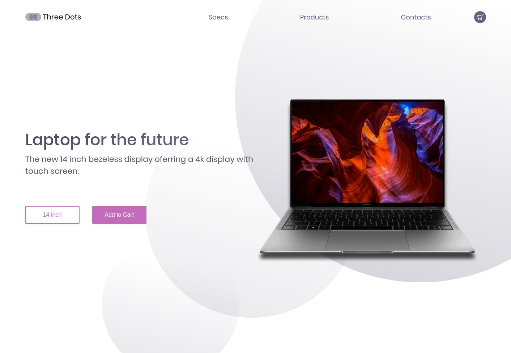

# Matebook Frontend


<p align="center">
    <a href="https://www.linkedin.com/in/yagoernandes">
        
    </a>
    <a href="#">
        
    </a>
    <a href="https://github.com/yagoernandes/myBusDf/stargazers">
        
    </a>
    <br />
    <a href="https://twitter.com/intent/follow?screen_name=yagoernandes">
        </a>
</p>

> Tela de simulação de venda para treinar diagramação, estilização e responsividade

## :heavy_check_mark: Resultado no desktop

<p align="center"></p>

## :heavy_check_mark: Resultado no mobile

<p align="center"></p>

# :construction_worker: Executando o projeto

Para clonar o projeto via HTTPS:
```shell
git clone https://github.com/yagoernandes/matebook-frontend-design.git
```

Abra a index.html normalmente em seu navegador, não há nenhuma dependência extra


## :postbox: Faq

**Quais as tecnologias utilizadas nesse projeto?**

- HTML
- CSS
##

**Como foi criado a responsividade?**

Apenas com media queries do CSS, não foi utilizado nenhuma biblioteca de estilos

---

<p align="center">
Made with :heart: by <a href="https://www.linkedin.com/in/yagoernandes">YagoErnandes</a>
</p>